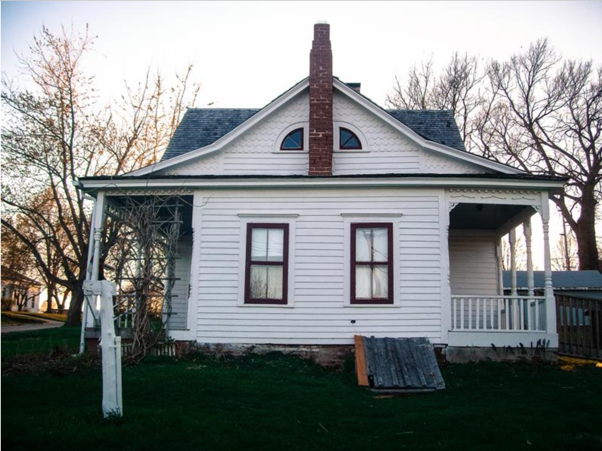

# Deep-Greetings
we generate deep greeting cards for major festivals.We use neural style transfer to generate the cover/background image of our greeting card/postcard and an LSTM model to generate text on the festival. We also use Augmented Reality to display a personalized greeting video of your choice on the card.

INPUT:
1. path of the content image
2. path of the video

SAMPLE OUTPUT:
(generated for halloween)

INPUT IMAGE:

OUTPUT CARD USING HALLOWEEN FILTER:

