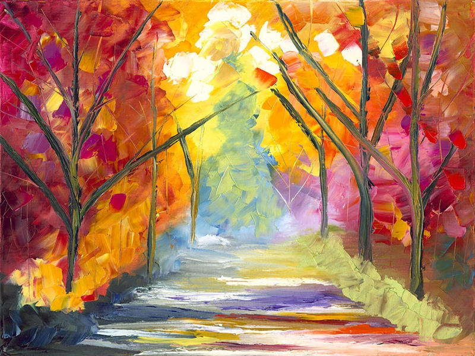
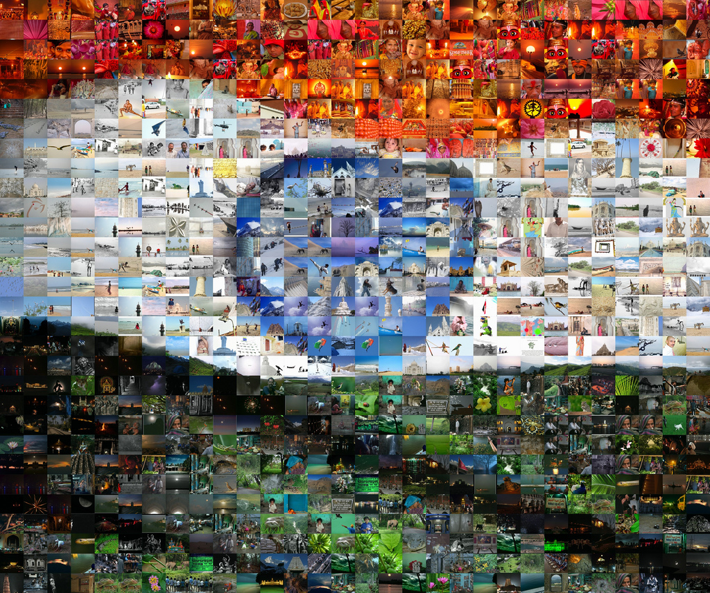
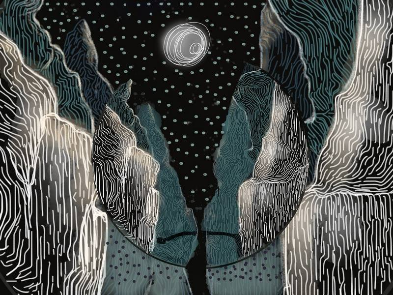
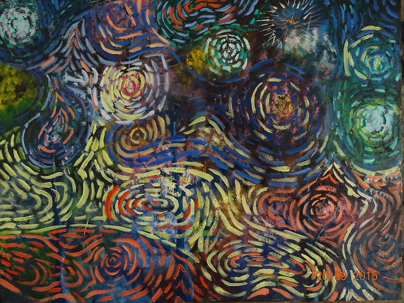
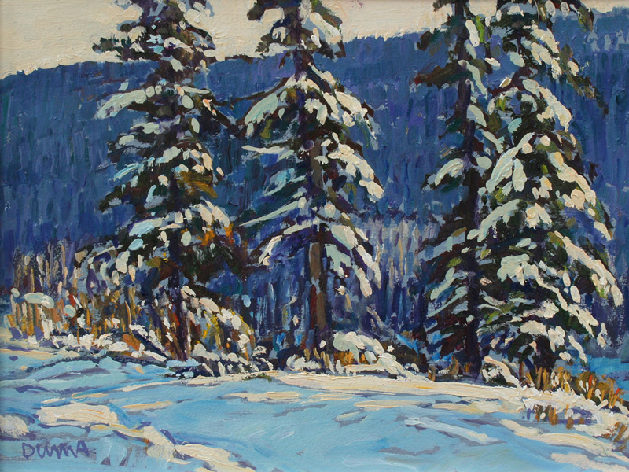
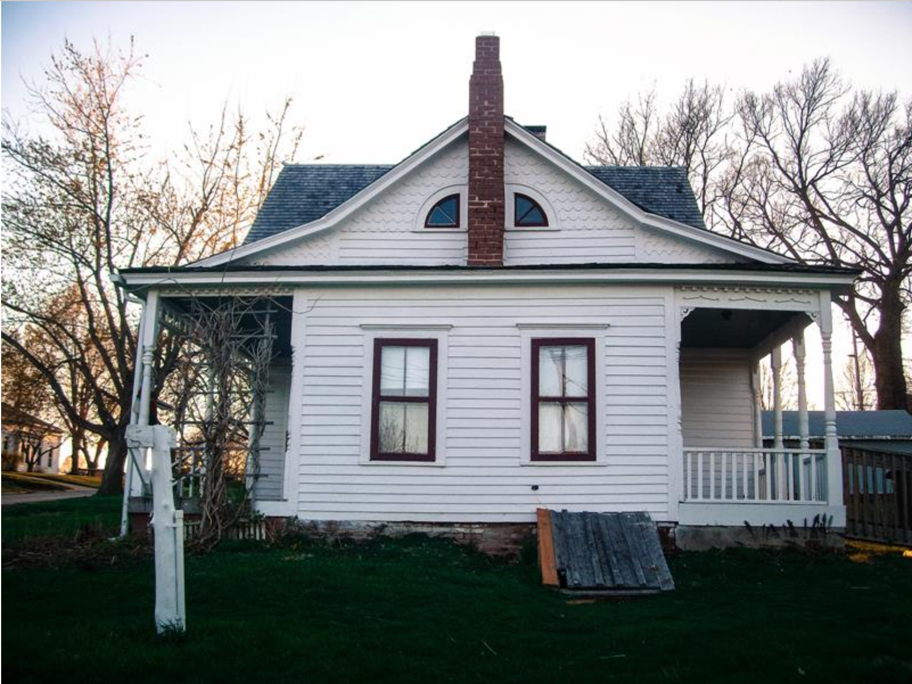
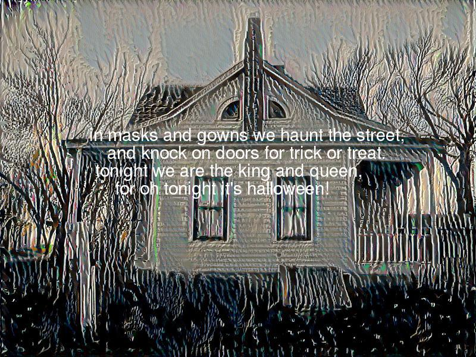

# Deep-Greetings
we generate deep greeting cards for the next major upcomin festival.
We use neural style transfer to generate the cover/background image of our greeting card/postcard and an LSTM model to generate text on the festival. 
We also use Augmented Reality to display a personalized greeting video of your choice on the card.

For neural style tranfers, the various style images we use for the festivals are:
1. Valentines day:

2. Independace Day:

3.Halloween:

4.Diwali:

5.Christmas:

The LSTM model is trained on the following text for the following festivals:
1. Valentines day:love poems
2.Independance Day:Freedom Speeches
3.Halloween: Horror stories and poems
4.Diwali: Diwali greetings
5.Christmas:Christmas Carols

to run the entire program, run main.py

INPUT:
1. path of the content image
2. path of the video

INPUT IMAGE:

OUTPUT CARD USING HALLOWEEN FILTER:

